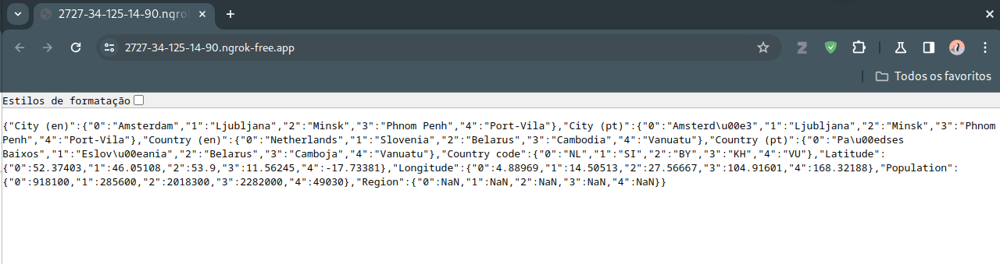

<h1>
    
     Formação Python Developer 
</h1>

# :computer: Desafio de projeto: 

## Criando uma API com Flask no Ambiente COLAB

Para este projeto o desafio final envolve a entrega de uma API desenvolvida no framework Flask utilizando a Plataforma COLAB. O Objetivo principal está relacionado com a leitura de uma planilha de dados no formato JSON utilizando uma API no ambiente de desenvolvimento colaborativo COLAB.

Nosso servidor FastAPI deve trazer a planilha gerada em JSON, assim, como estamos apresentando um “Hello Word” neste exemplo. Para isso, deve ser dado um {Public_URL}/index no navegador para chegar ao nosso endpoint, pois criamos apenas uma rota, ou seja , /index .

# :bulb: Solução do desafio

A solução se encontra no notebook DIO_api_flask.ipynb

Uma planilha CSV é lida e convertida para dicionário usando a biblioteca pandas. A planilha em formato json é mostrada no página inicial do servidor usando o flask jasonify.

Não foi possível conectar ao servidor usando o pacote flask_ngrok, então usei o pyngrok como indicado na documentação do ngrok. É necessário criar uma conta e obter o token de acesso.

Segue o exemplo de output:

